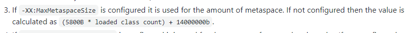

# Pinpoint Install

https://github.com/pinpoint-apm/pinpoint


## Install java

```bash
sudo apt-get update && sudo apt-get upgrade
sudo apt-get install openjdk-8-jdk

java -version
```

### Environment

```bash
vim ~/.bashrc

export JAVA_HOME=$(dirname $(dirname $(readlink -f $(which java))))
export PATH=$PATH:$JAVA_HOME/bin

source ~/.bashrc

echo $JAVA_HOME
```

or

```bash
vim /etc/profile

export JAVA_HOME=/usr/lib/jvm/java-8-openjdk-amd64
export PATH=$PATH:$JAVA_HOME/bin

source /etc/profile
echo $JAVA_HOME
```

## Install Hbase
https://www.guru99.com/hbase-installation-guide.html

### Install HBase in Ubuntu with Standalone Mode
No dependency on Hadoop system

- This is default mode of HBase
- It runs against local file system
- It doesn’t use Hadoop HDFS
- Only HMaster daemon can run
- Not recommended for production environment
- Runs in single JVM

```bash
wget https://archive.apache.org/dist/hbase/1.2.7/hbase-1.2.7-bin.tar.gz

tar -xvf hbase-1.2.7-bin.tar.gz
```

#### Environment

```bash
vim hbase-1.2.7/conf/hbase-env.sh

# The java implementation to use.  Java 1.8+ required.
export JAVA_HOME=/usr/lib/jvm/java-8-openjdk-amd64
```

```bash
vim ~/.bashrc

export HBASE_HOME=/home/ubuntu/hbase/hbase-1.2.7
export PATH=$PATH:$HBASE_HOME/bin
```

```bash
hbase-1.7.2/bin/start-hbase.sh

jps

14676 HMaster
14935 Jps
```

### Create Schema

https://github.com/pinpoint-apm/pinpoint/blob/master/hbase/scripts/hbase-create.hbase

```bash
wget https://raw.githubusercontent.com/pinpoint-apm/pinpoint/master/hbase/scripts/hbase-create.hbase

hbase shell ./hbase-create.hbase
```

## Install Pinpoint 

### Collector

```bash
wget https://github.com/pinpoint-apm/pinpoint/releases/download/v2.2.2/pinpoint-collector-boot-2.2.2.jar

chmod +x pinpoint-collector-boot-2.2.2.jar

nohup java -jar -Dpinpoint.zookeeper.address=localhost pinpoint-collector-boot-2.2.2.jar > /dev/null 2>&1 &
```

-Dpinpoint.zookeeper.address=localhost
- standalone mode가 아닐경우 hdfs기반의 hbase 운영 기반이 되었을 zookeeper 주소를 넣도록 한다.

### Web

```bash
wget https://github.com/pinpoint-apm/pinpoint/releases/download/v2.2.2/pinpoint-web-boot-2.2.2.jar

chmod +x pinpoint-web-boot-2.2.2.jar

nohup java -jar -Dpinpoint.zookeeper.address=localhost pinpoint-web-boot-2.2.2.jar >/dev/null 2>&1 &
```

---

# Pinpoint Agent


## Setup pinpoint agent

```bash
wget https://github.com/pinpoint-apm/pinpoint/releases/download/v2.2.2/pinpoint-agent-2.2.2.tar.gz

tar xvzf pinpoint-agent-2.2.2.tar.gz

vim pinpoint-agent-2.2.2/pinpoint-root.config

# pinpoint collector ip로 수정한다.
profiler.transport.grpc.collector.ip=pinpoint-collector-ip
```

ip 수정후 재압축하여 s3 업로드 한다.
```bash
mv pinpoint-agent-2.2.2 pinpoint-agent
tar -zcvf pinpoint-agent.tar.gz pinpoint-agent

https://app-config-file.s3.ap-northeast-2.amazonaws.com/pinpoint-agent.tar.gz
```

## Push application with agent ECR

```bash 
./gradlew agent1:jibDockerBuild
./gradlew agent2:jibDockerBuild

aws ecr get-login-password --region ap-northeast-2 | docker login --username AWS --password-stdin 225953240914.dkr.ecr.ap-northeast-2.amazonaws.com

docker push 225953240914.dkr.ecr.ap-northeast-2.amazonaws.com/pinpoint-agent-one:latest
docker push 225953240914.dkr.ecr.ap-northeast-2.amazonaws.com/pinpoint-agent-one:agent1-1660413368137

docker push 225953240914.dkr.ecr.ap-northeast-2.amazonaws.com/pinpoint-agent-two:latest
docker push 225953240914.dkr.ecr.ap-northeast-2.amazonaws.com/pinpoint-agent-two:agent2-1660413368137
```

## Run image

```bash
docker pull 225953240914.dkr.ecr.ap-northeast-2.amazonaws.com/pinpoint-agent-one:latest
docker run -d --name agentone -p 80:10001 225953240914.dkr.ecr.ap-northeast-2.amazonaws.com/pinpoint-agent-one

docker pull 225953240914.dkr.ecr.ap-northeast-2.amazonaws.com/pinpoint-agent-two:latest
docker run -d --name agenttwo -p 80:10002 225953240914.dkr.ecr.ap-northeast-2.amazonaws.com/pinpoint-agent-two
```

### Agent One Application


### Agent Two Application


### Error example


---

# Issue

## [OOM by Metaspace](https://github.com/TASK-FORCE/mannalga-api/issues/354)

> Spring Boot Gradle Plugin 으로 bootBuildImage Task를 사용하여 이미지를 빌드 할 경우,  
> 클라우드 파운드리에 있는 [자바 빌드 메모리 계산기]로 휴리스틱하게 메모리 사용 예상치를 계산해서  
> 그 값으로 LIMIT를 걸어버립니다. (heap, non-head 영역 모두)
>
> 빌드 시점에는 pinpoint 모니터링을 위한 pinpoint agent가 반영되어있지 않았고,  
> javaagent로 pinpoint agent를 추가하여 가동할 경우 추가적인 메모리 사용으로 인해  
> 예측된 양보다 많은 메모리를 사용해서 발생한 문제였습니다.
>
> non-heap 메모리 부분이 제한을 넘어서자, heap영역의 메모리가 다 차지도 않았는데  
> jvm이 non-heap 영역의 메모리를 확보하기 위해 FULL GC  

[Java Buildpack Memory Calculator](https://github.com/cloudfoundry/java-buildpack-memory-calculator)


[Triggering of gc on Metaspace memory in java 8](https://stackoverflow.com/questions/44713423/triggering-of-gc-on-metaspace-memory-in-java-8)